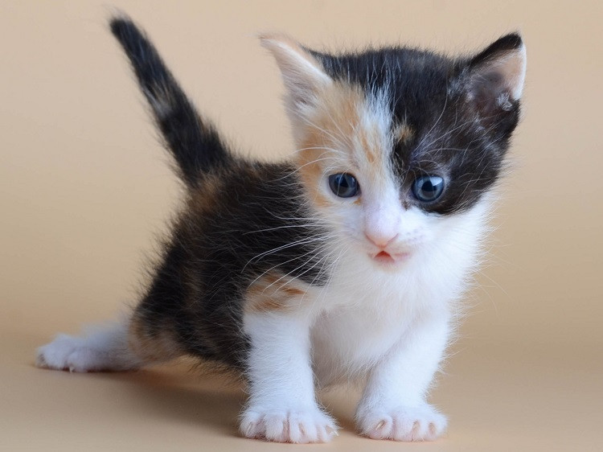

# Markdown шпаргалка 
## Абзацы
Абзацы создаются при помощи пустой строки:

Путь в тысячу ли начинается с первого шага. Чтобы быть сильным, надо быть как вода. 

Нет препятствий – она течёт; плотина – она остановится; прорвётся плотина – она снова потечёт; в четырёхугольном сосуде она четырёхугольна; в круглом – кругла. ... 

## Заголовки
Заголовки отмечаются символом # в начале строки, от одного до шести:
# Заголовок 1 
## Заголовок 2 
### Заголовок 3 
#### Заголовок 4 
##### Заголовок 5 
###### Заголовок 6

## Курсивный шрифт
Курсивный шрифт создается одноразовым оборачиванием текста с помощью символов * или _:

Это слово выделено *курсивом*. Это слово тоже выделено _курсивом_.

## Жирвный шрифт
Жирвный шрифт создается двойным оборачиванием текста с помощью символов * или _:

Это слово выделено как **жирное**. Это слово тоже выделено как __жирное__.

## Сслыки
Ссылки создаются оборачиванием текста в квадратные скобки [] и адреса в круглые ():

Это встроенная [ссылка](https://github.com/yuri26nev/college).
В круглых скобках, после адреса, в кавычках можно указать значение для аттрибута title:
Это встроенная [ссылка с атрибутом title](https://github.com/ "Сылка на GITHUB").

## Изображение
Изображения создаются с помощью квадратных скобок [] между которымы пишется значение для атрибута alt и пути к изображению между круглыми скобакми():

Значение для атрибута title можно указать после пути:

## Маркированный список
Для разметки маркированных списков ul можно использовать или *, -, или + в начале строки:

* Молоко
* Масло
* Яблоки

##Горизонтальная линия
Горизонтальная линия hr создается тремя звездочками или тремя дефисами:

--- 
***
